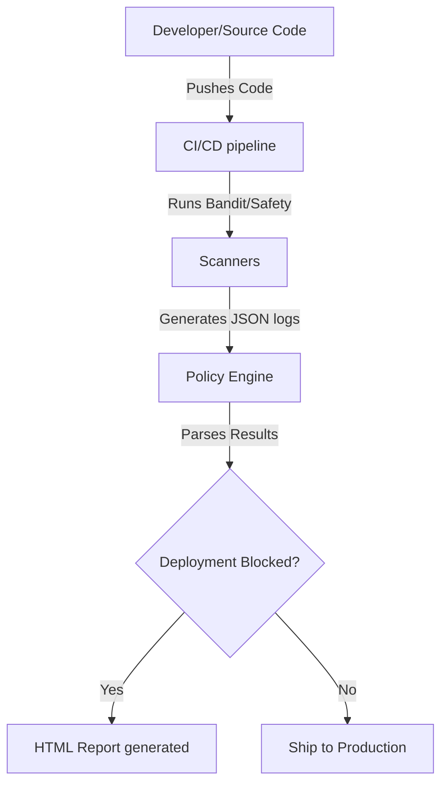

# Aegis: Automated DevSecOps Pipeline & Retro CRT Security Console

Aegis is an interactive DevSecOps dashboard and policy scanner that automates security verification for Python applications, dependencies, and container images. It provides a visual demonstration of common vulnerability injections, live Web Application Firewall (WAF) mitigation controls, and automated policy scanning.

---

## 📺 The Retro CRT Phosphor Green Interface

Aegis features a premium, immersive **90s Retro CRT Terminal** theme styled with glowing phosphor elements, scanlines, and vignette shadow overlays:

* **3D Vanishing Grid Horizon**: The background features an animated HTML5 vector wireframe grid that scrolls forward and responds to mouse coordinates with elastic warp physics.
* **Threat Lab Mainframe Simulator**: A CLI emulator shell that prints live stream stdout logs when SQL Injection, Directory Traversal, or Remote Code Execution (RCE) vectors are simulated against local endpoints.
* **WAF Shield Control**: A toggle switch modeled as an analog hardware lever to dynamically shift the application status between `VULNERABLE` (raw bypasses allowed) and `ARMED_SHIELD` (WAF blocking active).
* **Consolidated Security Reports**: Clean, monospace visual layout utilizing custom web fonts (`VT323` and `Share Tech Mono`) for readability under high-density diagnostic data.

---

## 🛡️ Core Architecture



* **HTML Report**: `scans/report.html` - Visual tactical mainframe report with diagnostic details of bandit and library scanner findings.
* **Markdown Report**: `scans/report.md` - Optimized for GitHub Job summaries.

---

## 📂 Project Structure

```txt
aegis/
├── app/
│   ├── main.py                # Main Flask dashboard & vulnerability routes
│   ├── secure_main.py         # Secure equivalent code (vulnerability fixes)
│   ├── database.py            # Simulated SQLite database for persistent actions
│   └── templates/
│       ├── index.html         # Main CRT terminal dashboard template
│       └── report_template.html # CRT diagnostics report template
├── scripts/
│   └── seed_db.py             # Pre-populates simulation database tables
├── scans/
│   ├── report.html            # Compiled static scan output
│   └── report.md              # Compiled markdown output
├── tests/
│   ├── test_policy.py         # Test suite for policy engine thresholds
│   └── test_waf.py            # Test suite for Web Application Firewall rules
├── policy_engine.py           # Evaluates scanner outputs against severity policies
├── setup.sh                   # Automated environment build and startup script
├── requirements.txt           # Production dependencies
├── requirements-dev.txt       # Dev & scanning dependencies (pytest, bandit, safety, etc.)
├── Dockerfile                 # Containerized image file
└── README.md                  # Project documentation
```

---

## 🛠️ Getting Started

### 1. Automated Setup & Run (Recommended)
You can set up dependencies, configure the SQLite databases, and start the application in one command:
```bash
chmod +x setup.sh
./setup.sh
```

### 2. Manual Setup
Activate a virtual environment and install packages:
```bash
python3 -m venv venv
source venv/bin/activate
pip install -r requirements.txt
pip install -r requirements-dev.txt

# Seed the database
python scripts/seed_db.py

# Launch server
python app/main.py
```
Open your browser to `http://127.0.0.1:5001`.

---

## 🧪 Testing

Aegis includes pytest coverage for scanning policy rules and WAF intercept controls:
```bash
# Activate virtual environment
source venv/bin/activate

# Execute tests
pytest
```

---

## 🚀 DevSecOps Implementation Workflow for Teams

You can use the patterns shown in Aegis to strengthen security in your production pipelines:

1. **Adopt Automated Code Linters**: Run tools like `bandit -r src/ -f json -o bandit-report.json` as a pre-commit hook or inside your PR tests.
2. **Fail Fast with Policy Engines**: Use `policy_engine.py` to assert scan findings. Return `exit 1` to fail pipelines automatically when any `HIGH` or `CRITICAL` vulnerability is introduced.
3. **Audit Third-Party Packages**: Run `safety check` to prevent outdated dependencies with known CVEs from reaching your production containers.
